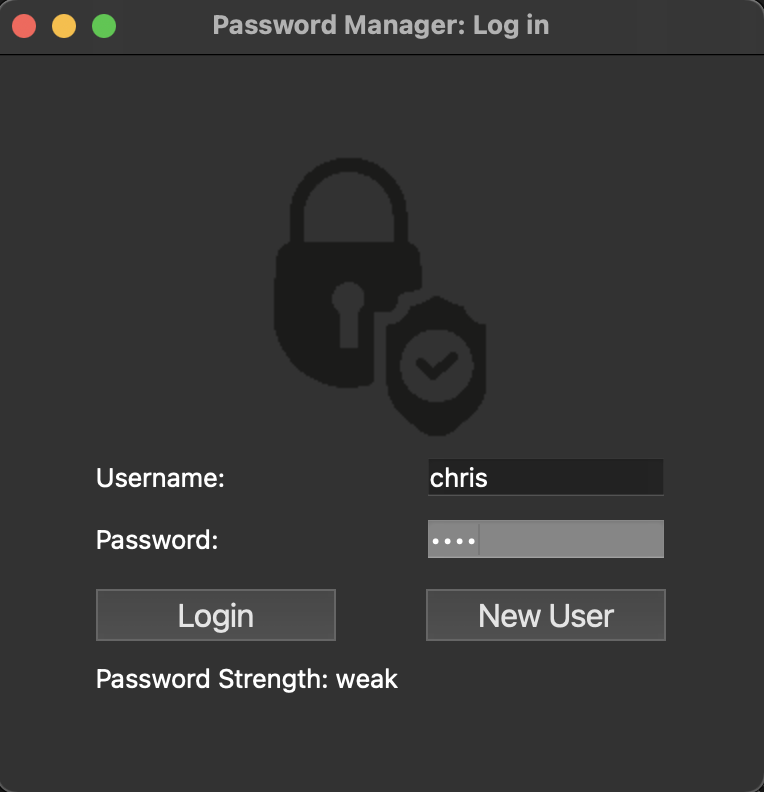
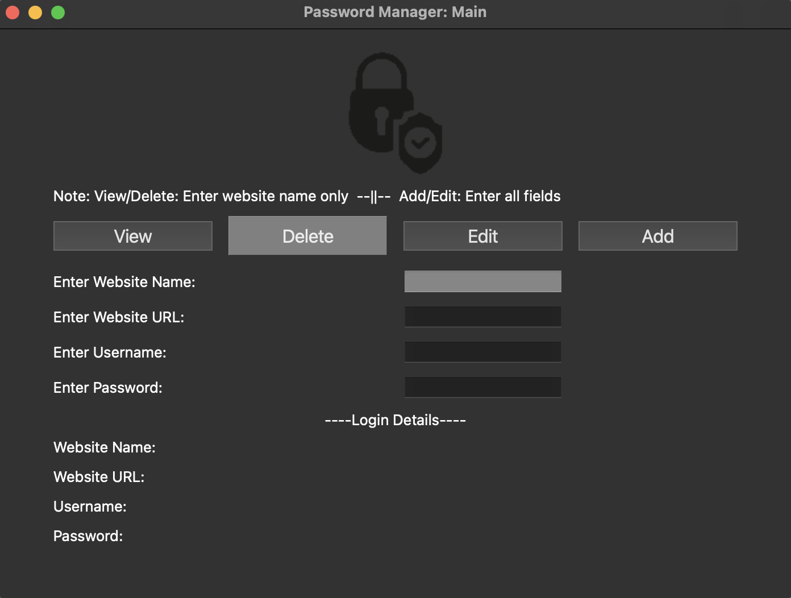

# Password Manager (Python with PyQt6)

## Description

This Application is a Password Manager for desktop, designed to allow a user[s] to create an account, log into their account, maintaining relative security with an encrypted password storage and upon authentication, add, view, edit and delete authentication information for any websites that they please. the passwords of these websites are also stored in the database encrypted as to provide a level of security in directly accessing the 'passmanager.json' file. 

Upon first initialisation, the encryption key is generated into the 'key.key' file in the main directory. This is not to be deleted or altered as it is require to decrypt the passwords stored in the database.

It is also required that a 'passmanager.json' file is present in the main directory upon running the program. 


## Dependencies

Python 3.x is needed to run the program as is PyQt6.x which can be installed as below from the terminal. 

```sh
   pip3 install PyQt6
  ```

## Installation

Run the program from the terminal by navigating to the /password_manager directory in the terminal and inputting:

```sh
   python3 main.py
  ```
  
 ## Usage

The Password Manager runs through a GUI with a simplistic interface. Upon running the program, the user is presented with a Login Window. The user can either Log in using the 'Log In' button after inputting the correct username and password, or the user can create a new account by inputting a username and password and clicking on 'New User' which will then prompt the user to click on the 'Log In' button to log into the newly created account. 

The program will display error messages for all login or account creation errors, while also displaying the strength of the current password as it is entered, while hiding the password characters from the screen. 

Log in Window:



Upon successful log in, the user will be presented with the main interface. It initialises with the basic usage instructions and has the buttons to perform 4 actions (View, Delete, Edit and Add). This is followed by 4 data entry text boxes, and then the list of login details below that.

View: the user can enter the name of a stored website in the first data entry box and upon clicking 'View' will be presented with the full login details for that website.

Delete: the user can enter the name of the stored website in the first data entry box and upon clicking 'Delete', the stored website will be deleted from the database(dictionary)

Edit: the user can enter the details of the stored website in all 4 of the data entry fields and upon clicking 'Edit' the stored website information will be amended.

Add: the user can enter the details of the website to be stored in all 4 of the data entry fields and upon clicking 'Add' the details will be stored in the database(dictionary) 

All relevant error messages will be displayed at the top of the screen when data is not accepted or incorrect. 

Main Interface Window:


